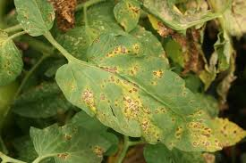
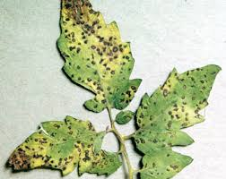
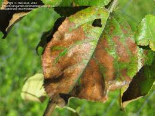
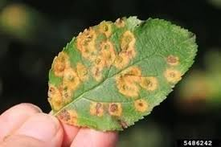

# PlantDiseaseDetectionSystem
A system to detect plant disease using the images of the plant leaf. 
CNN is used to classify the leaf images. Here Deeplearning is exploited to recognize the visible symptoms of plant diseases.  	PlantDiseaseDetection.ipynb is the python notebook which was used on kaggle kernel to generate my_model.h5. This model is also available in the repository. TestModel.ipynb, this notebook is using the model to classify the test images. The model could achieve 67% accuracy with 70-30 Data split. 
The data set is present on kaggle 
<a herf="https://www.kaggle.com/vipoooool/new-plant-diseases-dataset">https://www.kaggle.com/vipoooool/new-plant-diseases-dataset</a>
 

 
<h1> Infected Leaves </h1>

  
  
  
  

